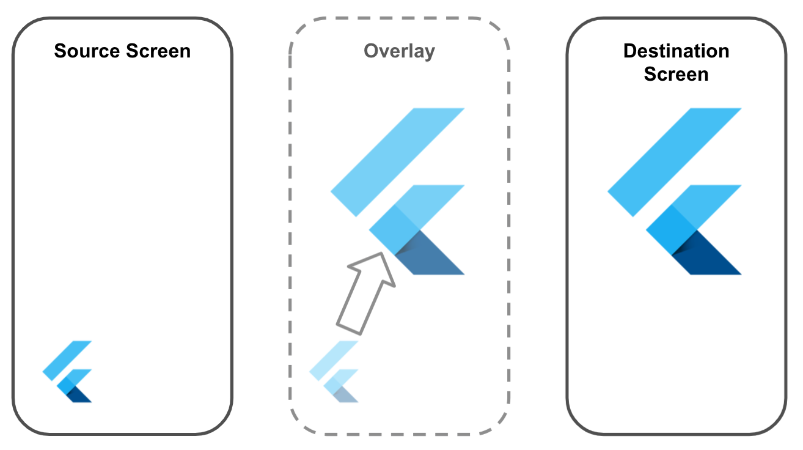

# Hero Animation Unmasked - Part 1

You all know Flutter's famous [Hero animation](https://flutter.dev/docs/development/ui/animations/hero-animations) where a "Hero" widget "flies" from one page to the next during a navigation transition:

<div style="text-align: center;">
  
</div>

This animation is pretty cool and is surely a great way to triggers that "Wow" effect with only a few lines of code.
🤔 It's so simple that it strangely looks like some kind of wizardry, doesn't it?
Have you ever wonder what was actually going on behind the scenes? What were the components at stake and how they all fit in together to produce such magic?
No? Well, let me take you on an adventure into the depth of the Flutter framework to **Unmasked this Hero Animation** by re-coding this lovely feature. Along the way, we shall learn a few things about Flutter's navigation, widget & elements trees, widgets lifecycle, geometry with dart, overlays... You're going to love it!

_Because this is a fairly long journey, I will split into 2 parts:_

- Hero Animation Unmasked - Part 1: Finding the Heroes
- Hero Animation Unmasked - Part 2: Making the Hero Fly

## Hero Animation's general mechanism

Before diving into the wicked part, let's have look at the general mechanism of this feature:

1. Given 2 pages (source & destination), which both contains `Hero` widgets with the a `tag` property holding the same value.
<div style="text-align: center;">
  
</div>

2. Copy the widget's content into an [Overlay](https://api.flutter.dev/flutter/widgets/Overlay-class.html)
<div style="text-align: center;">
  
</div>

3. Animate the overlayed widget from the source to the destination position on screen
<div style="text-align: center;">
  
</div>

This 1 part [(Flutter Hero Animation Unmasked - Part 1)](./Flutter_Hero_Animation_Unmasked_Part_1.md) will focus on steps 1 and 2. Step 3. is described in the second part of this article: ["Flutter Hero Animation Unmasked - Part 2"](./Flutter_Hero_Animation_Unmasked_Part_2.md).

If you want to learn more about the actual Flutter implementation of the Hero Animation, well you know how it goes: "Head on to flutter.dev": https://flutter.dev/docs/development/ui/animations/hero-animations

## Example source code

The entire source code of what we are going to do can be found here: [hero-animation-unmasked](https://github.com/guitoof/hero-animation-unmasked) with a step by step [commits breakdown](https://github.com/guitoof/hero-animation-unmasked/commits/master).

This sample application contains 2 pages:

- a source page: **Hero List** rendering the list of `HeroTile` widgets to display heroes retrieved from the `heroes_data.dart` file
- a destination page: **Hero Details** displayed upon click on one of the listed heroes and rendering their avatar.

If you wish to code along, you can begin at this commit: [d124af0471](https://github.com/guitoof/hero-animation-unmasked/tree/d124af047113b17525e51244668c18edee12190a) as a starting point, where we use the actual `Hero` widget to produce the targeted result.

In the next sections, I will be mentioning each time the commit corresponding to the current step, if you wish to checkout the actual source code.

## 🙌 Let's Code!

### 1. Meet the UnmaskedHero

In both `hero_tile.dart` and `hero_details.dart` we remove the magic Hero widgets (Commit: [803a203](https://github.com/guitoof/hero-animation-unmasked/commit/803a2031f3d28f83528067cc67036819635bd377)) and replace them with our own.
Since we are definitely going to see the "true identity" of our Hero widget by implementing it ourselves, let's call it: `UnmaskedHero` and save it at `lib/packages/unmasked_hero/unmasked_hero.dart`: custom `UnmaskedHero` `StatefulWidget` (Commit: [065bd9d](https://github.com/guitoof/hero-animation-unmasked/tree/065bd9d004a6175369490ae7e01ebcab02954fde)):

```dart
/// lib/packages/unmasked_hero/unmasked_hero.dart

import 'package:flutter/material.dart';

class UnmaskedHero extends StatefulWidget {
  final String tag;
  final Widget child;

  UnmaskedHero({required this.tag, required this.child});

  @override
  UnmaskedHeroState createState() => UnmaskedHeroState();
}

class UnmaskedHeroState extends State<UnmaskedHero> {
  @override
  Widget build(BuildContext context) {
    return widget.child;
  }
}
```

```dart
/// hero_tile.dart & hero_details.dart

child: Hero(
	tag: hero.id,
	child: Image.network(
	  hero.avatar,
	),
),
```

replaced by:

```dart
child: UnmaskedHero(
	tag: hero.id,
	child: Image.network(
	  hero.avatar,
	),
),
```

And we now have a regular transition without any widget flying from one page to the other ...

<div style="text-align: center;">
  
</div>

**BooooOOOORING! 👎**

### 2. Listen to the Navigation

<div style="text-align: center;">
  
</div>

#### 2.1. Extends NavigatorObserver to listen to navigation behaviors

Commit: [b18b384](https://github.com/guitoof/hero-animation-unmasked/commit/b18b3847d6ff22ff045afe4247f1efabce5ce5fa)

In `lib/packagesunmasked_hero` create a `UnmaskedHeroController` extending the `NavigatorObserver` class:

```dart
/// lib/packages/unmasked_hero/unmasked_hero_controller.dart

import 'package:flutter/widgets.dart';

class UnmaskedHeroController extends NavigatorObserver {
  @override
  void didPush(Route<dynamic> route, Route<dynamic>? previousRoute) {
    print('Navigating from $previousRoute to $route');
    super.didPush(route, previousRoute);
  }
}
```

and pass it to the `navigatorObservers` property of the `MaterialApp` in your `main.dart`

```dart
/// main.dart

return MaterialApp(
      initialRoute: 'hero_list_page',
      navigatorObservers: [UnmaskedHeroController()],  /// <--- Add this line
      routes: {
        'hero_list_page': (context) => HeroListPage(),
        'hero_details_page': (context) => HeroDetailsPage(),
      },
    );
```

This allows us to listen to navigation events like `didPush`.

#### 2.2 Check flight validity & ignore if does not have a valid origin & destination

<div style="text-align: center;">
  
</div>

Commit: [5426287](https://github.com/guitoof/hero-animation-unmasked/commit/5426287eb05216d2018ba3e500de357a4e94ae1f)

```dart
/// lib/packages/unmasked_hero/unmasked_hero_controller.dart

...

/// Checks whether the hero's flight has a valid origin & destination routes
bool _isFlightValid(PageRoute? fromRoute, PageRoute toRoute) {
  if (fromRoute == null) {
      return false;
  }
  BuildContext? fromRouteContext = fromRoute.subtreeContext;
  BuildContext? toRouteContext = toRoute.subtreeContext;
  if (fromRouteContext == null || toRouteContext == null) {
      return false;
  }
  return true;
}

@override
void didPush(Route<dynamic> toRoute, Route<dynamic>? fromRoute) {
WidgetsBinding.instance?.addPostFrameCallback((Duration value) {
    /// If the flight is not valid, let's just ignore the case
    if (!_isFlightValid(fromRoute as PageRoute?, toRoute as PageRoute)) {
    return;
    }
});
super.didPush(toRoute, fromRoute);
}
```

### 3. "Heroes, Assemble!"

<div style="text-align: center;">
  
</div>

#### 3.1 Visit & Invite source & dest. heroes

Commit: [ccfba16311c555d6b3947621371158da625bb90e](https://github.com/guitoof/hero-animation-unmasked/commit/ccfba16311c555d6b3947621371158da625bb90e)

```dart
/// lib/packages/unmasked_hero/unmasked_hero_controller.dart

...
/// Visit & Invite all heroes of given context to the party
Map<String, UnmaskedHeroState> _inviteHeroes(BuildContext context) {
  Map<String, UnmaskedHeroState> heroes = {};
  void _visitHero(Element element) {
    if (element.widget is UnmaskedHero) {
      final StatefulElement hero = element as StatefulElement;
      final UnmaskedHero heroWidget = hero.widget as UnmaskedHero;
      final dynamic tag = heroWidget.tag;
      heroes[tag] = hero.state as UnmaskedHeroState;
    } else {
      element.visitChildren(_visitHero);
    }
  }

  context.visitChildElements(_visitHero);
  return heroes;
}

...

@override
void didPush(Route<dynamic> toRoute, Route<dynamic>? fromRoute) {
    WidgetsBinding.instance?.addPostFrameCallback((Duration value) {
        /// If the flight is not valid, let's just ignore the case
        if (!_isFlightValid(fromRoute as PageRoute?, toRoute as PageRoute)) {
          return;
        }
        final BuildContext fromContext = fromRoute!.subtreeContext!;
        final BuildContext toContext = toRoute.subtreeContext!;

        Map<String, UnmaskedHeroState> sourceHeroes = _inviteHeroes(fromContext);
        for (UnmaskedHeroState hero in sourceHeroes.values) {
        print(
            "Source Hero invited: tag = ${hero.widget.tag}, type = ${hero.widget.child.runtimeType}");
        }
        Map<String, UnmaskedHeroState> destinationHeroes =
            _inviteHeroes(toContext);
        for (UnmaskedHeroState hero in destinationHeroes.values) {
        print(
            "Destination Hero invited: tag = ${hero.widget.tag}, type = ${hero.widget.child.runtimeType}");
        }
    });
    super.didPush(toRoute, fromRoute);
}
```

Let's break down and see what's going on here:

1.  with the `_inviteHeroes` method, we recursively browse a given context to "visit" and find all instances of the `UnmaskedHero` widget.
2.  in the `didPush` overriden method, we call the `_inviteHeroes` method on both **"from"** and **"to"** contexts so that we gather lists of source & destination heroes.
3.  finally, we wrap this whole logic inside a callback passed to `WidgetsBinding.instance?.addPostFrameCallback`

There are 2 interesting things, I would like to highlight:

1. the `_visitHero` method shows how to navigate recursively through the Element tree to find some elements which are instances of widgets. If you want to learn more about Flutter's rendering behavior and the difference between Widget, Element & RenderObject, checkout [this talk on the subject](https://www.youtube.com/watch?v=996ZgFRENMs&t=1s)
2. We call the `WidgetsBinding.instance?.addPostFrameCallback`. Because the `didPush` method of an observer is called right after the page is actually push into the navigation stack, the context of the destination route has not been mounted yet. Without `addPostFrameCallback`, the context of the `toRoute` page would be null and we would fallback into the case: `isFlightValid(...) == false`. With this callback, we wait for the newly pushed page to be built and ensure that the `toRoute.subtreeContext` is well defined, so that we can look for the instances of our Hero elements. If you want to understand more this method, take a look at this French article: [addPostFrameCallback](https://www.didierboelens.com/fr/2019/04/addpostframecallback/) as well as the [documentation](https://api.flutter.dev/flutter/scheduler/SchedulerBinding/addPostFrameCallback.html).

This prints the following statements:

```bash
flutter: Source Hero invited: tag = spiderman, type = Image
flutter: Source Hero invited: tag = ironman, type = Image
flutter: Source Hero invited: tag = starlord, type = Image
flutter: Source Hero invited: tag = captain_america, type = Image
flutter: Source Hero invited: tag = thor, type = Image
flutter: Destination Hero invited: tag = spiderman, type = Image
```

The `_inviteHeroes` finds all `UnmaskedHeroes` from the source page and 1 single `UnmaskedHero` from the destination page corresponding to the one we selected.

#### 3.2 Check source/dest. match before flying

Commit: [12be82ad115eaa0571aae43d7b88997e34a32f03](https://github.com/guitoof/hero-animation-unmasked/commit/12be82ad115eaa0571aae43d7b88997e34a32f03)

Now that we can invite all Heroes from both the source and the destination pages, we want to focus only on the ones existing on both.

```dart
...
Map<String, UnmaskedHeroState> sourceHeroes = _inviteHeroes(fromContext);
Map<String, UnmaskedHeroState> destinationHeroes =
    _inviteHeroes(toContext);
for (UnmaskedHeroState hero in destinationHeroes.values) { /// browse throught the heroes of the destination page
  if (sourceHeroes[hero.widget.tag] == null) { /// if no hero with a matching tag has been found on the source page, ignore it.
    continue;
  }
  /// Here we can be sure that the current hero has both
  /// a source to fly from
  /// and a destination to fly to
  print(
      "Start flying with Hero with tag = ${hero.widget.tag}, type = ${hero.widget.child.runtimeType}");
}
```

### 4. Display the flying Hero on overlay

<div style="text-align: center;">
  
</div>

Commit: [fba28365be2633b48bfca642769ada8f419d786d](https://github.com/guitoof/hero-animation-unmasked/commit/fba28365be2633b48bfca642769ada8f419d786d)

Now that we took a hold on our flying Hero, let's create and call a `_displayFlyingHero` method to make them appear on screen using Flutter's [Overlay class](https://api.flutter.dev/flutter/widgets/Overlay-class.html)

```dart
/// Display Hero on Overlay
void _displayFlyingHero(UnmaskedHeroState hero) {
  if (navigator == null) {
    print('Cannot fly without my navigator...');
    return;
  }
  final BuildContext navigatorContext = navigator!.context;
  print(
      "Start flying with Hero with tag = ${hero.widget.tag}, type = ${hero.widget.child.runtimeType}");

  OverlayEntry overlayEntry;
  overlayEntry = OverlayEntry(
    builder: (BuildContext context) => Container(
      child: hero.widget.child,
    ),
  );
  Navigator.of(navigatorContext).overlay?.insert(overlayEntry);
}

...

@override
void didPush(Route<dynamic> toRoute, Route<dynamic>? fromRoute) {
  WidgetsBinding.instance?.addPostFrameCallback((Duration value) {
    ...

    for (UnmaskedHeroState hero in destinationHeroes.values) {
      if (sourceHeroes[hero.widget.tag] == null) {
        print(
            'No source Hero could be found for destination Hero with tag: ${hero.widget.tag}');
        continue;
      }
      _displayFlyingHero(hero);
    }
  }
}
```

Here, we create an [`OverlayEntry`](https://api.flutter.dev/flutter/widgets/OverlayEntry-class.html), wrap our hero widget's child inside and pass it to `navigator.overlay.insert` to display a widget over the whole content of the app. This is a great feature of Flutter that you can leverage to craft your own modals, floating action sheets or overlaying "Help" features.

<div style="text-align: center;">
  
</div>

With this, our `UnmaskedHero`'s child is displayed majestically over the rest of the app 🎉 ... but it does not fly yet ...

### To be continued ...

That is already a lot to process, so I suggest that we take a break so that you can digest it all.
Let's take a look at what we've done so far:

1. We understood the general mechanism of the Hero Animation
2. We created our own `UnmaskedHero` widget and its `UnmaskedHeroController`
3. We hooked ourselves to the `didPush` Navigation method to react to navigation
4. We browsed the Elements Tree to look for interesting Widget instances
5. We displayed our `UnmaskedHero` into the screen overlay

I really hope that you enjoyed this 1st Part of Hero Animation Unmasked. Hopefully, this Hero widget should start to appear less magical.
In the next part [Hero Animation Unmasked - Part 2](./Flutter_Hero_Animation_Unmasked_Part_2.md), we'll make our Hero fly from the source page to the destination by playing a little more with elements' positions and adding the animation.

If you have any questions, if you find any mistakes or inaccuracies or if you just want to have a chat about Flutter, I'd be very happy to. You can find me on Twitter [@Guitoof](https://twitter.com/guitoof) or on the [Flutter Community Slack](https://fluttercommunity.slack.com/) where I also go by the name `Guitoof`.

## Acknowledgment

I'd like to give a big and sincere shoutout to:

- The Flutter Team for your great documentation on [Hero animations](https://flutter.dev/docs/development/ui/animations/hero-animations)
- [@mslimani](https://twitter.com/mslimanii) for your great article that gave me a great deal of insight and understanding [Hero – le super widget](https://blog.ineat-group.com/2020/02/hero-le-super-widget-flutter-tips-of-the-month-2/)
- [@mjohnsullivan](https://twitter.com/mjohnsullivan) & Andrew Fitz Gibbon for their talk on [How Flutter renders widget](https://www.youtube.com/watch?v=996ZgFRENMs) that helped me understand the Elements tree, render objects and that famous BuildContext.
- [@laufman](https://twitter.com/laufman) for his wonderful cartoony drawings of my favorite superheroes. Make sure to check out his awesome work on his blog: [https://www.dereklaufman.com/](https://www.dereklaufman.com/)
